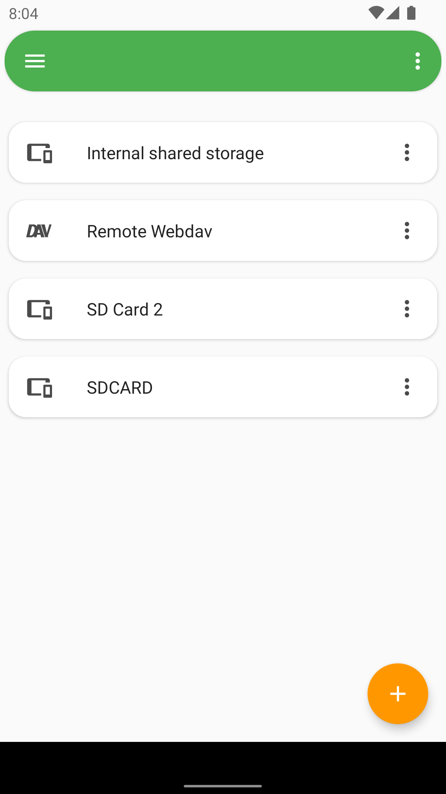
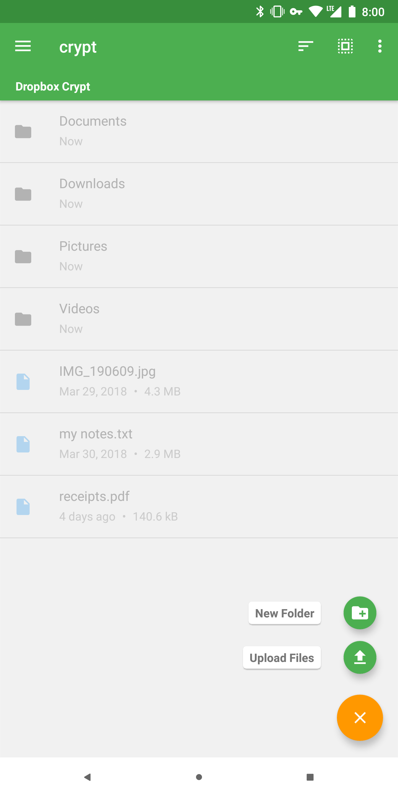
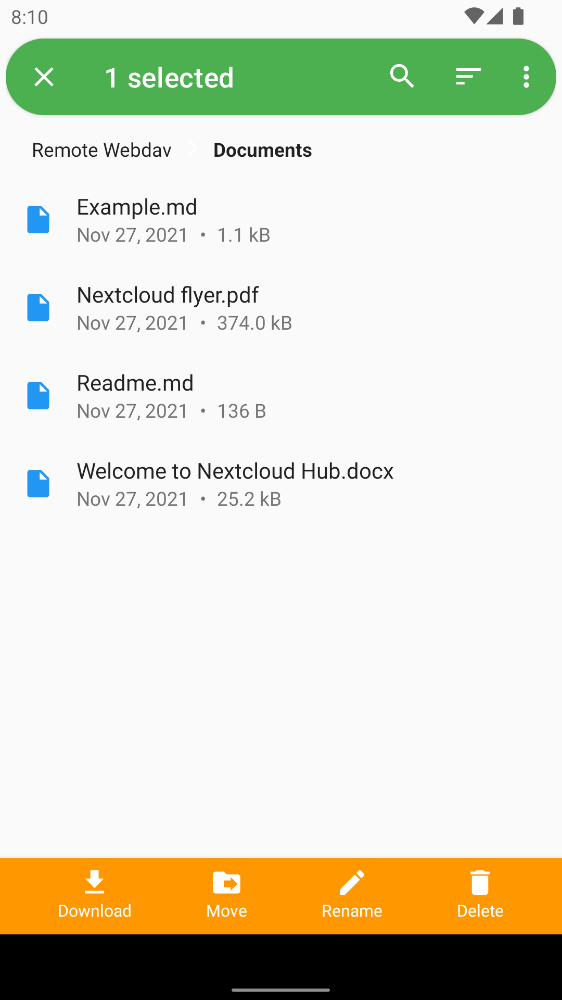
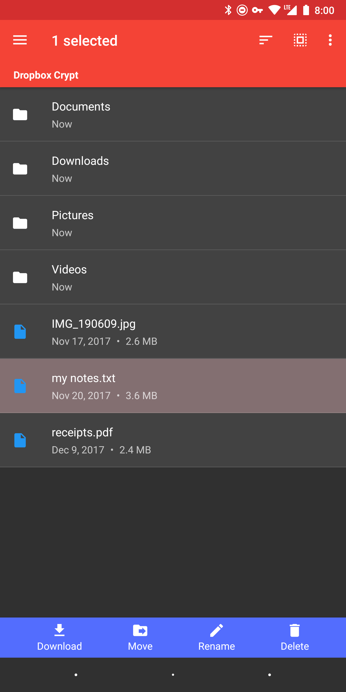
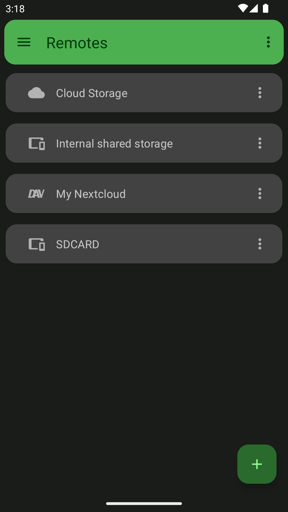
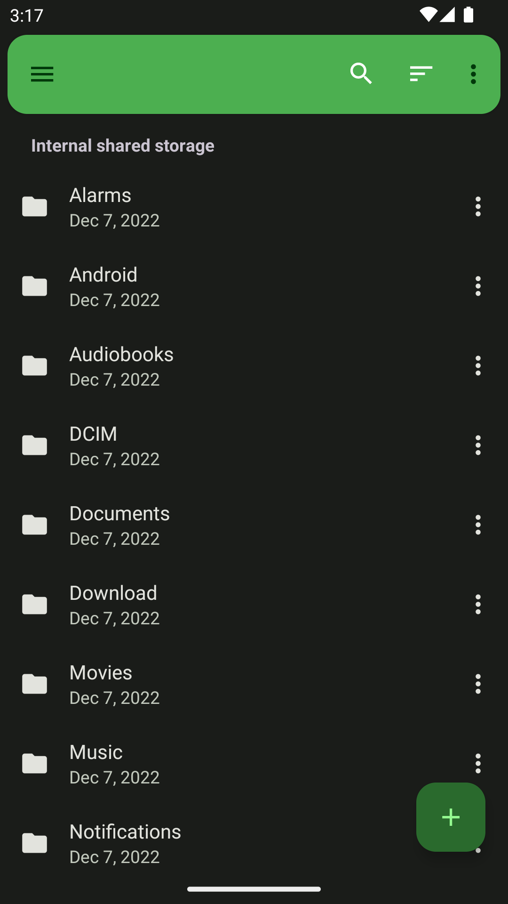
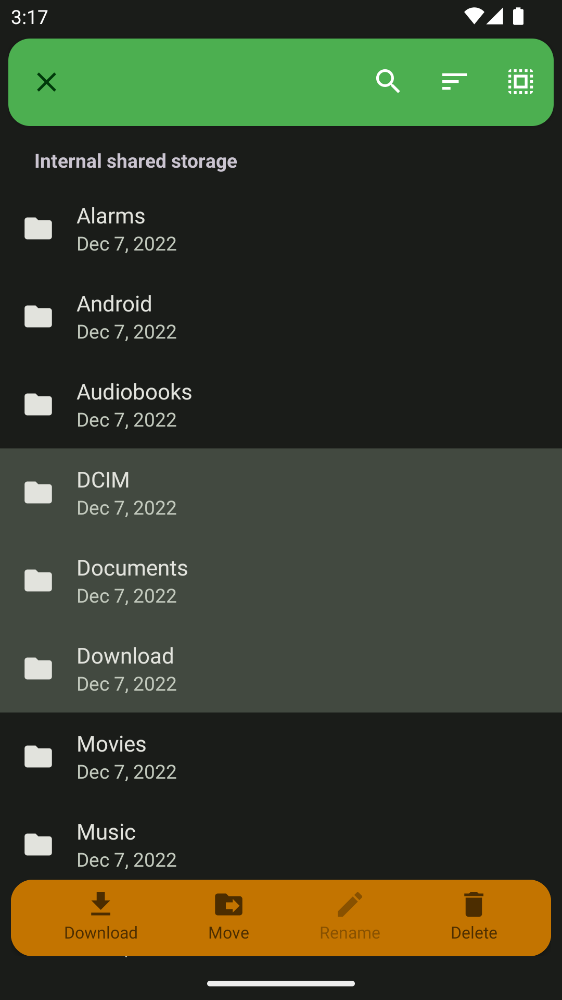

# extRact - Rclone for Android
[](https://github.com/newhinton/extract/blob/master/LICENSE) [](https://github.com/newhinton/extract/releases) [](https://github.com/newhinton/extract/releases/latest)

A cloud file manager, powered by rclone. 

<br/>
<br/>

Current State
-------- 
## ⚠️ 🏗️  This app is currently undergoing many changes. It may not be fully stable and contain bugs or untested features. Use at your own risk!  ⚠️ 🏗️

<br/>
<br/>

Features
--------

Cloud Access | 256 Bit Encryption<sup>[1](https://rclone.org/crypt/#file-encryption)</sup> | Integrated Experience
:-----:|:--------------:|:-----------:
 |  | 
Use your cloud storage like a local folder. | Keep your files private on any cloud provider with crypt remotes. | Don't give up features or comfort just because it runs on a phone.

- **File Management** (list, view, download, upload, move, rename, delete files and folders)
- **Streaming** (Stream media files, serve files and directories over FTP, HTTP, WebDAV or DLNA)
- **Integration** (Access local storage devices and share files with the application to store them on a remote)
- **Many cloud storage providers** (all via rclone config import, some without ui-setup)
- **Material 3 Design** (Dark theme)
- **All architectures** (runs on ARM, ARM64, x86 and x64 devices, Android 7+)
- **Storage Access Framework (SAF)** ([see docs](https://x0b.github.io/docs/#adding-local-storage-saf)) for SD card and USB device access.
- **Intentservice** to start tasks via third party apps!
- **Task Management** to allow regular runs of your important tasks!


Screenshots
-----------
|                                Manage Storage                                 |                                Explore Files                                  |                                 Manage Files                                  |                                 Set up Tasks                                  |
:-----------------------------------------------------------------------------:|:-----------------------------------------------------------------------------:|:-----------------------------------------------------------------------------:|:-----------------------------------------------------------------------------:|
  |  |  |  |
  |  |  |  |


Intentservice
-------------
This app includes the ability to launch an intent! Create a task to sync to a remote, and copy it's id (via the treedot-menu)
The intent needs the following:

| Intent        | Content       |         |
| :------------- | :-------------: | -------------: |
| packageName      | ca.pkay.rcloneexplorer | |
| className      | ca.pkay.rcloneexplorer.Services.SyncService | |
| Action    | START_TASK | |
| Integer Extra    | task | idOfTask |
| Boolean Extra    | notification | true or false |

Installation
------------
Grab the [latest version](https://github.com/x0b/rcx/releases/latest) of the signed APK and install it on your phone. You can also [register for the closed Google Play testing group](https://groups.google.com/forum/#!forum/rcx-alpha/join), the [Google Play Beta](https://play.google.com/apps/testing/io.github.x0b.rcx), or on [F-Droid](https://f-droid.org/packages/io.github.x0b.rcx).

| CPU architecture | Where to find | APK identifier |
|:---|:--|:---:|
|ARM 32 Bit | older devices | ```armeabi-v7a``` |
|**ARM 64 Bit** | **most devices** | ```arm64-v8a``` |
|Intel/AMD 32 Bit | some TV boxes and tablets | ```x86``` |
|Intel/AMD 64 Bit | some emulators | ```x86_64``` |

If you don't know which version to pick use ```rcx-<version>-universal-release.apk```. Most devices run ARM 64 Bit, and 64 Bit devices often can also run the respective 32 bit version at lower performance. The app runs on any phone, tablet or TV with Android 7 or newer, as long as you have a touchscreen or mouse.

Usage
------------
[See the documentation](https://x0b.github.io/docs/).

Developing
------------

You should first make sure you have:

- Go 1.20+ installed and in your PATH
- Java installed and in your PATH
- Android SDK command-line tools installed OR the NDK version specified in `gradle.properties`
  installed

You can then build the app normally from Android Studio or from CLI by running:

```sh
# Debug build
./gradlew assembleOssDebug

# or release build
./gradlew assembleOssRelease
```

Known Issues
------------
- Reauthorization of OAuth remotes shows intermittent failures. This is currently under investigation.
- Theming is currently not applied properly.

Contributing
------------
See [CONTRIBUTING](./CONTRIBUTING.md)


License
-----------------
### About this app
This app is released under the terms of the [GPLv3 license](https://github.com/newhinton/extract/blob/master/LICENSE). Community contributions are licensed under the MIT license, and [CLA Assistant](https://cla-assistant.io/) will ask you to confirm [a CLA stating that](https://gist.githubusercontent.com/x0b/889f037d76706fc9e3ab8ee1c047841b/raw/67c028b19e33111428904558cfda0c01039d1574/rcloneExplorer-cla-202001) if create a PR.


This is a fork of RCX by [x0b](https://github.com/x0b) which is itself a fork of rcloneExplorer by [Patryk Kaczmarkiewicz](https://github.com/kaczmarkiewiczp). For the original repository, see [kaczmarkiewiczp/rcloneExplorer](https://github.com/kaczmarkiewiczp/rcloneExplorer) or [x0b/rcx](https://github.com/x0b/rcx). If you want to convey a modified version (fork), we ask you to use a different name, app icon and package id as well as proper attribution to avoid user confusion.

### Libraries
- [rclone](https://github.com/rclone/rclone) - Calling this a library is an understatement. Without rclone, there would not be RCX. See https://rclone.org/donate/ to support rclone.
- [Jetpack AndroidX](https://developer.android.com/license)
- [Floating Action Button SpeedDial](https://github.com/leinardi/FloatingActionButtonSpeedDial) - A Floating Action Button Speed Dial implementation for Android that follows the Material Design specification.
- [Glide](https://github.com/bumptech/glide) - An image loading and caching library for Android focused on smooth scrolling.
- [MarkdownJ](https://github.com/myabc/markdownj) - converts markdown into HTML.
- [Material Design Icons](https://github.com/Templarian/MaterialDesign) - 2200+ Material Design Icons from the Community.
- [Recyclerview Animators](https://github.com/wasabeef/recyclerview-animators) - An Android Animation library which easily add itemanimator to RecyclerView items.
- [Toasty](https://github.com/GrenderG/Toasty) - The usual Toast, but with steroids.
- Icons from [Flaticon](https://www.flaticon.com) courtesy of [Smashicons](https://www.flaticon.com/authors/smashicons) and [Freepik](https://www.flaticon.com/authors/freepik)
